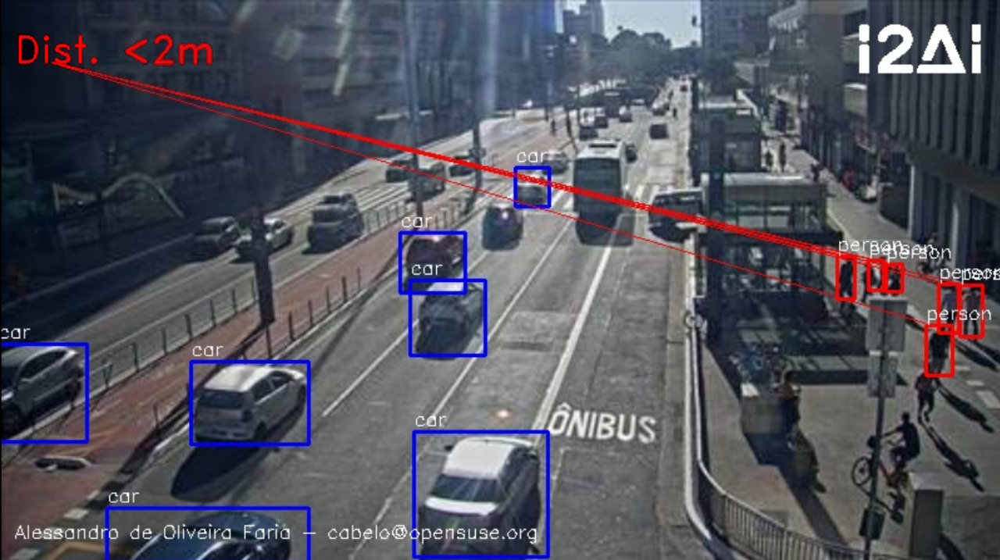

# isolalert

***ISOALERT*** is a Project created to analyze the behavior of the population, calculate the necessary distance between people to avoid contagion (COVID-19) and statistical processing of the number of people and vehicles in a given region.

## Building the ISOALERT

### Download Intel® oneAPI Base Toolkit

The firt thing you need is to download and install the Intel® oneAPI Base Toolkit.

You can register, download and information about install it from the following link (Linux version): https://software.intel.com/content/www/us/en/develop/tools/oneapi/download.html#basekit 

### Clone the project

Clone the repository at desired location:

``` bash
# git clone https://github.com/cabelo/isolalert
```

### Download the required files

Download the required files. You will have to download the pre-trained weight file and another. Or just run these commands:

``` bash
$ wget https://raw.githubusercontent.com/pjreddie/darknet/master/cfg/yolov3.cfg

$ wget https://pjreddie.com/media/files/yolov3.weights

$ wget https://raw.githubusercontent.com/pjreddie/darknet/master/data/coco.names

```

### Build the project

Now execute 


``` bash
$ /usr/bin/c++ -I/opt/intel/inteloneapi/vpl/latest/include  -o isolalert.cpp.o  -c isolalert.cpp
$ /usr/bin/c++ isolalert.cpp.o -lcurl  /opt/intel/inteloneapi/vpl/latest/lib/libopencv_world.so -o isolalert 

```

### The final result

Bellow an example running in Avenue Paulista in public Brazil camera.

contact : Alessandro de Oliveira Faria (A.K.A.CABELO) cabelo@opensuse.org


